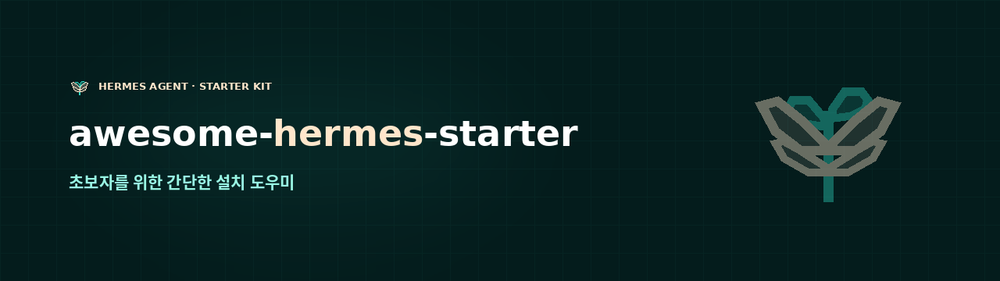

**[한국어](README.md)** · English

**A setup helper for [Hermes Agent](https://github.com/NousResearch/Hermes-Agent), for people starting out.**

Bring it up with one command and **finish in the browser.** No pasting keys into
a terminal, and no credit card. Built for NAS boxes and home servers.

```bash
git clone https://github.com/jshsakura/awesome-hermes-starter && cd awesome-hermes-starter
cp .env.example .env                                    # just pick a login
HERMES_UID=$(id -u) HERMES_GID=$(id -g) docker compose up -d
# → http://<your-server>:9120  ← five steps here
```

**[▶ See the site](https://jshsakura.github.io/awesome-hermes-starter/)** — the compose to copy, the three things to change, and a
[clickable demo](https://jshsakura.github.io/awesome-hermes-starter/demo/) of the screen. Same code, canned answers instead of a server.

**Installing on a NAS? See the [per-box copy-paste guide](docs/deploy.en.md)** —
plain Docker · Portainer and Synology DSM. No terminal.

## First-run setup, in the browser

After `docker compose up`, open **`http://<your-server>:9120`**. Hermes' own dashboard
(`:9119`) assumes you already know what you are doing, so this sits in front of it.

| Step | |
|---|---|
| **API key** | The steps to get an OpenRouter key, and the key is verified the moment you paste it |
| **Model** | The live list of what is *actually* free right now, with tool-calling and context shown, and fallbacks picked alongside |
| **Telegram** | From @BotFather to `/start`, and **it finds your chat id for you.** Ends by sending a real test message |
| **Tools** | Five MCP servers that need no signup and no key. The recommended three install with one button |
| **Done** | Applies, restarts, and **actually asks the agent a question** |

At the end it hands you a link into Hermes proper. **Once you are comfortable, use that** —
this screen has done its job.

Korean and English toggle in the UI.

---

The second half of this README is a **curated list**. The Korean edition of that list
is the reason this repo exists — the Hermes ecosystem is large (236,907★ upstream) and
has good things in it, but almost none of it is written up in Korean. If you read
Korean, [start there](README.md#큐레이션-목록).

---

## Why this exists

Hermes is **not hard to install.** `curl | bash` and it is on your machine. What comes
after is the hard part.

- **You stay in the terminal.** `source ~/.bashrc` → `hermes model` → `hermes setup`
- **It touches your host.** uv, Python 3.11, Node.js, ripgrep and ffmpeg get installed.
  There is a Docker path, but upstream's compose is `build: .` — it compiles SQLite from source
- **You still need a paid key.** Find a provider key or buy a subscription before the first reply

This distribution removes all three. Browser only, nothing on the host but Docker, and
you start on **OpenRouter's free models.**

## What's inside

| Service | What it does |
|---|---|
| `gateway` | Talks to Telegram. Long-polls, so it **publishes no port** |
| `dashboard` | The web UI. Published, and therefore **login-protected** |
| `freemodels` | Keeps the free-model list current (optional) |

The image is the published `nousresearch/hermes-agent:latest`. **Nothing is built and
no version is pinned** — you always get current Hermes. This repo is compose files and
documentation; it does not fork or patch Hermes.

## First run

All `.env` needs is **a login and two random strings.** No API key, no bot token.

```bash
cp .env.example .env

# DASHBOARD_USER / DASHBOARD_PASSWORD  — one account for both screens
# DASHBOARD_SECRET=$(openssl rand -hex 32)
# API_SERVER_KEY=$(openssl rand -hex 24)

HERMES_UID=$(id -u) HERMES_GID=$(id -g) docker compose up -d
```

Then open **`http://<your-server>:9120`** and walk the five steps. Getting an
OpenRouter key and creating a Telegram bot are both explained on screen.

> **Never leave `TELEGRAM_ALLOWED_USERS` empty.** If it is, anyone who finds your
> bot is talking to your agent — with your files, your keys and your quota. The
> setup screen fills it in for you, and refuses to save it empty.

If you would rather do it from a terminal, `scripts/telegram-chat-id.sh` prints
your chat id. **Stop the gateway first** with `docker compose stop gateway` —
Telegram hands each update to whoever asks first, and only once.

## Free models keep changing

On a single day, 2026-08-27, `deepseek-chat-v3.1:free`, `llama-3.3-70b:free` and
`gemma-3-27b:free` all lost their free endpoint — **while keeping the same name.**
Pin a model id and one day it quietly stops working.

[free-rotator](https://github.com/GoSlowPoke168/hermes-openrouter-free-rotator) re-reads
the list daily and rewrites `model.default` and the fallbacks. It drives that from a
**system crontab**, though, and there is no cron daemon inside the container. So the
`freemodels` service runs the same command from a plain sleep loop instead
(**00:01 UTC** — the free allowance resets at midnight UTC).

It rewrites your config, so it is off by default:

```bash
docker compose exec gateway hermes plugins install GoSlowPoke168/hermes-openrouter-free-rotator
docker compose --profile freemodels up -d
```

## Things worth knowing

**The free tier is 50 requests a day.** Failed 429s count too, and it resets at midnight
UTC. **Buying $10 of credit once raises it to 1,000/day permanently** — a lifetime unlock,
not a balance requirement, so spending the credit later does not drop you back. More than
$10 buys you nothing extra.

**Free variants are squeezed copies of the same model.** Free endpoints run fp4, fp8 or
nvfp4; none are bf16. `nemotron-3.5-lightning` is bf16 on the paid endpoint and nvfp4 on
the free one.

**Your prompts may be trained on.** Many free endpoints only open up once you enable the
privacy toggles on your OpenRouter account (*Free endpoints that may train on request data*
and friends).

**Only `./files` is visible to the agent.** Do not mount your whole NAS share.
`./data` is everything Hermes remembers — that is what you back up.

**The dashboard refuses to start without auth.** A non-loopback bind with no auth provider
is a startup error (`--insecure` stopped bypassing this in the June 2026 hardening).

---

# Curated list

The full annotated list — with star counts and last-updated dates — lives in the
[Korean README](README.md#큐레이션-목록). Star counts are as of 2026-08-27, and
**unmaintained projects are marked as such**: a link collection that sends you down
dead ends is worse than no list.

## Frontends

The built-in dashboard is already usable, but there are better ones. **Don't build another.**

- [hermes-webui](https://github.com/nesquena/hermes-webui) — 17,759★ · the most popular web/mobile frontend
- [hermes-desktop](https://github.com/fathah/hermes-desktop) — 14,044★ · desktop app
- [hermes-workspace](https://github.com/outsourc-e/hermes-workspace) — 6,516★ · chat, terminal, memory, skills and inspector in one workspace

## Deployment · Docker

- [evey-setup](https://github.com/42-evey/evey-setup) — 65★ · free models plus 29 plugins in one go. **Closest in purpose to this repo**
- [hermes-agent-docker](https://github.com/xmbshwll/hermes-agent-docker) — 48★ · minimal Docker sandbox image
- [Nora](https://github.com/solomon2773/Nora) — 47★ · self-hosted control plane for Docker/Kubernetes (RBAC)
- [nix-hermes-agent](https://github.com/0xrsydn/nix-hermes-agent) — 42★ · reproducible deploys as a Nix/NixOS module
- [hermes-autonomous-server](https://github.com/JackTheGit/hermes-autonomous-server) — 15★ · unattended systemd/cron operation · *dormant since 2026-03*
- [hermes-agent-template](https://github.com/Crustocean/hermes-agent-template) — 5★ · cloud deployment template · *dormant since 2026-03*

## Free models · routing

- [hermes-openrouter-free-rotator](https://github.com/GoSlowPoke168/hermes-openrouter-free-rotator) — 11★ · ranks the free models daily and rewrites your config. **What this repo wires up for Docker**
- [hermes-openrouter-catalog](https://github.com/HaTas2025/hermes-openrouter-catalog) — 1★ · OpenRouter catalog
- [hermes-model-catalog](https://github.com/JoseTabora93/hermes-model-catalog) — 0★ · curated model list (Spanish)

## Broader lists

- [awesome-hermes-agent](https://github.com/0xNyk/awesome-hermes-agent) — 5,464★ · skills, plugins and tools. **Start here**
- [awesome-hermes-agent](https://github.com/Anil-matcha/awesome-hermes-agent) — 50★ · another curation

## Korean-language resources

Honestly, **all of these are dormant.** That is part of why this repo exists.

- [hermes-ko](https://github.com/tmdgusya/hermes-ko) — 3★ · 2026-05 · Korean docs and community
- [hermes-agent_one-click_kit](https://github.com/Huntbae/hermes-agent_one-click_kit) — 1★ · 2026-06 · **Windows .bat** one-click kit (if you want the non-Docker route)
- [hermes-docs-ko](https://github.com/jaechulleehi/hermes-docs-ko) — 0★ · 2026-04 · Korean docs
- [hermes-tutorial-22ki](https://github.com/daht-mad/hermes-tutorial-22ki) — 0★ · 2026-05 · install tutorial

---

## Contributing

Korean-language Hermes material of any kind is welcome. When you add something to the
list, **include its star count and last-updated date** — so nobody gets sent to a dead link.

Docs are Korean-first: `README.md` is the source of truth and `README.en.md` follows it.
If you change one, change the other.

## License

MIT. So is [Hermes Agent](https://github.com/NousResearch/Hermes-Agent).
